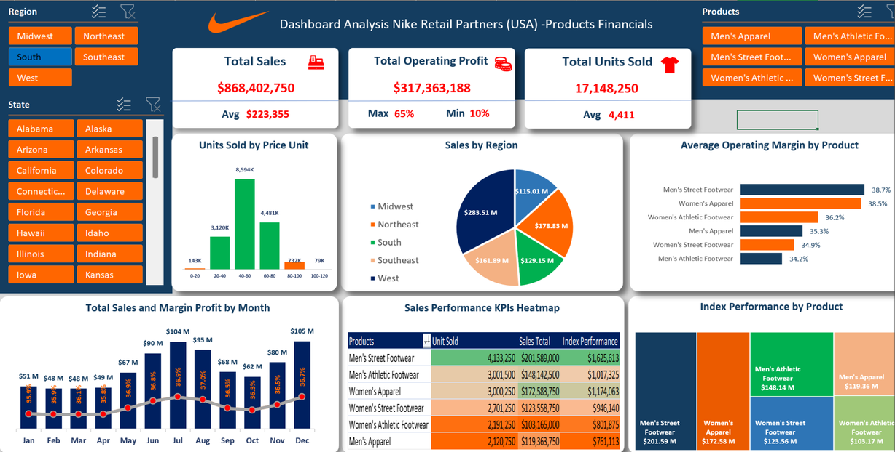
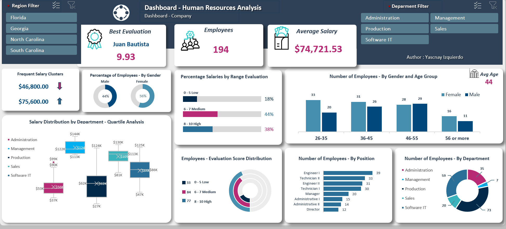

<h1 align="center">Hi there, I'm Yascnay Izquierdo 👋</h1>

  Junior Data Analyst | Python Enthusiast | Power BI Developer

  
  
  
  

---

### 🔍 About Me

I'm a Junior Data Analyst with 20 years of experience in the technology industry, and the last 4 years fully focused on developing data analytics skills. I enjoy transforming raw data into clear, actionable insights to help organizations make better decisions.

I'm proficient in:
- **Power BI** (including DAX and Power Query)
- **SQL**
- **Python**
- **Excel**

I'm curious, detail-oriented, and always eager to learn and improve. I love finding ways to simplify and automate tasks to save time and increase efficiency.

---

### 💼 Recent Projects

- 🧾 Automated sales data extraction for a restaurant chain using Python — reduced processing time from 30 minutes to seconds.
- 📊 Built dashboards in Power BI for performance tracking and decision support.
- 🗃️ Designed SQL databases and optimized queries for reporting in a web-based system.

---

### 🛠️ Technical Skills

- **Data Analysis**: SQL Server, Excel (Power Pivot, Power Query), Python (pandas, matplotlib)
- **Data Visualization**: Power BI, Excel Dashboards
- **Reporting & Automation**: ETL processes, ad hoc reports, automation with Python
- **Soft Skills**: Problem solving, teamwork, clear communication
<table style="width:100%">
<tr>
<td>
 <h3>👟 Nike Sales Dashboard (Excel)</h3>

  

</td>
<td><h3>👥 Human Resources Dashboard (Excel)</h3>

  This dashboard provides insights into employee distribution, salary clusters, evaluation scores, and department performance. Built in Excel with dynamic filters and professional visual design.

 

  

 
</td>
<tr>
<td>

<strong>Built in Excel using:</strong>

<ul>
  <li>Pivot Tables &amp; Charts</li>
  <li>Slicers for product filtering</li>
  <li>Conditional formatting for KPIs</li>
</ul>
</td>
<td>
  

  <strong>Built in Excel using:</strong>

<ul>
  <li>Pivot Tables &amp; Charts</li>
  <li>Slicers for region and department filters</li>
  <li>Quartile and distribution analysis</li>
</ul>
</td>
</tr>
<tr>
  <td>
[📎 Download Excel file](https://github.com/yascnay/ExamplesExcel/blob/main)
  </td>
  <td>
    

  📎 <a href="https://github.com/yascnay/ExamplesExcel/raw/main/HumanResourcesDashboard.xlsx">Download Excel File</a>
    

  </td>
</tr>
</table>

  ### 📫 How to reach me

- 📧 Email: [yascnay@gmail.com](mailto:yascnay@gmail.com)
- 💼 LinkedIn:[linkedin.com/in/yascnay-izquierdo/](https://linkedin.com/in/yascnay-izquierdo/)
- 📍 Based in Orlando, FL

---

Thanks for visiting my profile! 🌟

